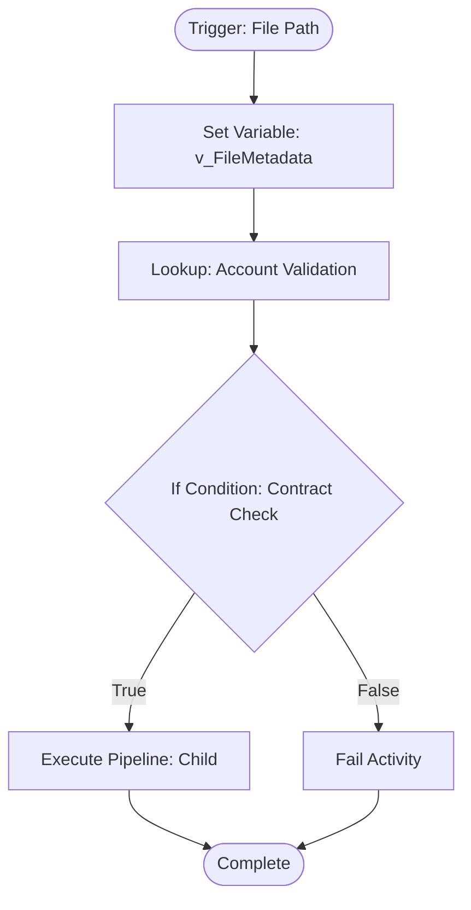
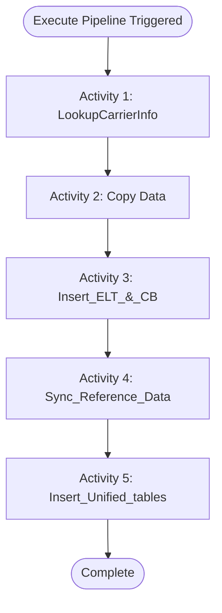
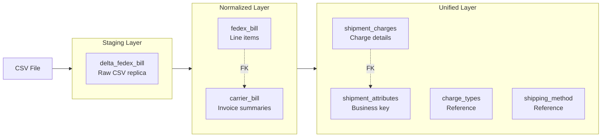

# ADF Bill Ingestion - Architecture Documentation

## 1. Project Overview

This project automates the ingestion of carrier billing CSV files into an Azure SQL Managed Instance. The ingestion process is metadata-driven, utilizing file paths to extract context (Account Numbers) and employing a **"Contract-First"** validation strategy to handle messy CSV structures (duplicate headers).

**Key Design Principles:**
- Metadata-driven orchestration via file path parsing
- Contract-first validation before data processing
- Idempotent pipeline activities for safe retries
- Transactional integrity where needed
- Incremental processing via timestamp tracking
- **Database parameterization:** Database names are parameterized via ADF Linked Services per environment (DEV/UAT/PROD). All SQL scripts reference only `schema.table` format.

---

## 2. Parent Pipeline: `pl_Master_Ingestion`

### Purpose
Entry point for all carrier billing file ingestion. Validates file structure and routes to appropriate carrier-specific child pipeline.

### Trigger Context
Currently trigger not implemented - in development phase passing file URL as parameter to pipeline runs.

**Future plans:** Will receive file path via event trigger (e.g., `falcon/fedex/594939735/bill.csv`).

### Pipeline Variables

| Variable | Type | Purpose |
|----------|------|---------|
| `v_FileMetadata` | Array | Stores parsed file path segments |

### Activity Flow



#### Activity 1: Set Variable - `v_FileMetadata`

**Purpose:** Parses file path into structured array for downstream processing.

**Expression:** Splits file path on `/` delimiter.

**Output Array Structure:**
- Index `[0]`: Tenant name (e.g., `falcon`)
- Index `[1]`: Carrier name (e.g., `fedex`)
- Index `[2]`: Account number (e.g., `594939735`)
- Index `[3]`: Filename (e.g., `bill.csv`)

This metadata drives routing, validation, and carrier-specific processing logic.

#### Activity 2: Lookup - Account Validation

**Purpose:** Reads first data row from CSV to validate account number matches folder structure.

**Configuration:**
- Source: Blob CSV file
- First Row Only: Yes
- Column Access: By ordinal position (`Prop_0`, `Prop_1`, `Prop_2`, etc.)

**Output:** Returns first row with account number in `Prop_2` and verifies presence of expected headers.

#### Activity 3: If Condition - Contract Validation

**Purpose:** Enforces contract-first validation to prevent ingestion of incorrect file formats.

**Condition Expression:**
```javascript
@and(
    equals(trim(string(activity('LookupAccountInFile').output.firstRow.Prop_2)), variables('v_FileMetadata')[2]),
    contains(string(activity('LookupAccountInFile').output.firstRow), 'Commodity Description')
)
```

**Validation Checks:**
1. Account number in file (`Prop_2`) matches folder name
2. File contains expected header `Commodity Description` (FedEx-specific validation)

**True Branch:** Proceeds to Execute Pipeline activity.

**False Branch:** Triggers Fail activity with error details.

#### Activity 4 (False Branch): Fail Activity

**Purpose:** Halts pipeline execution with descriptive error for troubleshooting.

**Configuration:**
- Error Code: `ERR_FILE_CONTRACT_MISMATCH`
- Error Message: `@concat('Validation Failed: Account mismatch or missing headers in file: ', pipeline().parameters.p_FilePath)`

#### Activity 5 (True Branch): Execute Pipeline - Child Invocation

**Purpose:** Routes validated file to carrier-specific transformation pipeline.

**Target Pipeline:** `pl_Fedex_transform` (currently hardcoded, will be parameterized by carrier name)

**Parameters Passed:**
- `v_Parent_FileMetadata`: Array containing parsed file path segments

**Future Enhancement:** Dynamic child pipeline selection based on `v_FileMetadata[1]` (carrier name).

---

## 3. Child Pipeline: `fedex_transform` (`pl_Fedex_transform`)

### Purpose
Processes FedEx billing data through staged transformation: raw CSV → staging → normalized → unified tables.

### Parameters Received

| Parameter | Type | Source | Purpose |
|-----------|------|--------|---------|
| `v_Parent_FileMetadata` | Array | Parent pipeline | File metadata for carrier identification |

### Activity Execution Order



---

#### Activity 1: Lookup - `LookupCarrierInfo.sql`

**Purpose:** Retrieves carrier metadata and last run timestamp for incremental processing.

**Script:** `fedex_transform/LookupCarrierInfo.sql`

**Input Parameters:**
- `v_FileMetadata[1]`: Carrier name (e.g., 'FedEx')

**Tables Accessed:**
- `dbo.carrier` (carrier master data)
- `billing.carrier_ingestion_tracker` (run history)

**Output Variables (for downstream activities):**
- `carrier_id` (INT): Carrier identifier
- `last_run_time` (DATETIME2): Last successful run timestamp, defaults to '2000-01-01' if first run

**Idempotent:** Yes (read-only query)

**Purpose Explanation:** This activity establishes the carrier context for all downstream transformations. The `carrier_id` is passed to SQL scripts to associate data with correct carrier, while `last_run_time` enables incremental processing by filtering only new records created since last successful run.

---

#### Activity 2: Copy Data - Load Staging Table

**Purpose:** Loads raw CSV data into staging table with positional mapping to handle duplicate headers.

**Source:** Azure Blob Storage (CSV file)

**Target Table:** `billing.delta_fedex_bill`

**Configuration (handling messy CSVs):**
- **First Row as Header:** Unchecked (forces ordinal column names: `Prop_0`, `Prop_1`, etc.)
- **Skip Line Count:** 1 (skips actual header row in file)
- **Column Mapping:** Empty (strict ordinal positioning - Column 1 → Column 1)

**Idempotent:** No (truncates staging table before each load, or uses date-based partitioning)

**Purpose Explanation:** The "anonymous positional load" strategy bypasses ADF's duplicate column name errors by treating headers as ordinal positions. This enables ingestion of FedEx files containing 50+ charge columns with duplicate names (e.g., multiple "Commodity Description" columns indexed as `_1`, `_2`, etc.).

---

#### Activity 3: Script - `Insert_ELT_&_CB.sql`

**Purpose:** Transforms staging data into normalized billing tables within a single transaction.

**Script:** `fedex_transform/Insert_ELT_&_CB.sql`

**Input Parameters:**
- `@Carrier_id`: From LookupCarrierInfo output

**Target Tables:**
1. `billing.carrier_bill` (invoice-level summaries)
2. `billing.fedex_bill` (line-level shipment data)

**Transaction Boundaries:** 
- **Transactional:** Yes (wrapped in `BEGIN TRANSACTION` / `COMMIT` / `ROLLBACK`)
- **ACID Properties:** Full atomicity - both tables succeed or both fail together
- **Error Handling:** `TRY...CATCH` block with automatic rollback on error
- **Auto Rollback:** `SET XACT_ABORT ON` ensures immediate rollback on any error

**Idempotent:** Yes
- Step 1: `INSERT ... WHERE NOT EXISTS (bill_number, bill_date)` prevents duplicate invoices
- Step 2: `INSERT ... WHERE NOT EXISTS (invoice_number, invoice_date, carrier_bill_id)` prevents duplicate line items
- Safe to retry after rollback (new `carrier_bill_id` values generated)

**Output Variables:**
- `Status`: 'SUCCESS' or 'ERROR'
- `InvoicesInserted`: Number of carrier_bill records inserted
- `LineItemsInserted`: Number of fedex_bill records inserted
- `ErrorNumber`, `ErrorMessage`: Error details (if failure)

**Purpose Explanation:** This two-step transactional script is the core normalization phase. Step 1 aggregates staging data by invoice (bill_number + bill_date) to create summaries with total amounts and shipment counts, generating `carrier_bill_id` surrogate keys. Step 2 inserts line-level details with foreign key references to carrier_bill. The transaction ensures referential integrity - you'll never have orphaned line items without invoice headers. Idempotency via NOT EXISTS checks makes the pipeline safe to retry after transient failures.

---

#### Activity 4: Script - `Sync_Reference_Data.sql`

**Purpose:** Auto-discovers and populates reference tables with new charge types and shipping methods from processed billing data.

**Script:** `fedex_transform/Sync_Reference_Data.sql`

**Input Parameters:**
- `@Carrier_id`: From LookupCarrierInfo output
- `@lastrun`: From LookupCarrierInfo output (filters new data only)

**Source Tables:**
- `billing.delta_fedex_bill` (for service types)
- `billing.vw_FedExCharges` (for charge descriptions)

**Target Tables:**
1. `dbo.shipping_method` (service types like 'Ground', 'Express')
2. `dbo.charge_types` (charge descriptions like 'Fuel Surcharge', 'Residential Delivery')

**Transaction Boundaries:** 
- **Transactional:** No (two separate INSERT statements)
- **Why No Transaction:** Reference data changes are independent; partial success acceptable

**Idempotent:** Yes
- Block 1: `INSERT ... WHERE NOT EXISTS (method_name, carrier_id)` prevents duplicate shipping methods
- Block 2: `INSERT ... WHERE NOT EXISTS (charge_name, carrier_id)` prevents duplicate charge types
- Safe to run multiple times - only inserts truly new values

**Output Variables:**
- `ShippingMethodsAdded`: Count of new shipping methods discovered
- `ChargeTypesAdded`: Count of new charge types discovered

**Purpose Explanation:** This script automatically maintains lookup tables by discovering new values from live data. When FedEx introduces a new service type or charge description, it's automatically captured and added to reference tables for future lookups. The auto-discovery approach eliminates manual reference data maintenance and ensures downstream transformations always have valid foreign key mappings. Categorization logic applies business rules (e.g., charges containing 'adjustment' → category 16, others → category 11).

---

#### Activity 5: Script - `Insert_Unified_tables.sql`

**Purpose:** Transforms normalized billing data into unified analytical tables with Multi-Piece Shipment (MPS) logic, creating business key relationships.

**Script:** `fedex_transform/Insert_Unified_tables.sql`

**Input Parameters:**
- `@Carrier_id`: From LookupCarrierInfo output
- `@lastrun`: From LookupCarrierInfo output (incremental processing)

**Source Tables:**
- `billing.fedex_bill` (for shipment attributes with MPS classification)
- `billing.vw_FedExCharges` (unpivoted charge data)
- `dbo.charge_types` (charge type lookups)

**Target Tables (2-part pipeline):**

**Part 1:** `billing.shipment_attributes`
- Business key: `carrier_id + tracking_number` (UNIQUE constraint)
- Contains: Shipment metadata (date, zone, dimensions, weight) - NO cost stored
- MPS Logic: 4-stage CTE pipeline classifies shipments (NORMAL_SINGLE, MPS_HEADER, MPS_PARENT, MPS_CHILD) and hoists header values to group members
- Filters out MPS_HEADER rows (summary rows not actual packages)

**Part 2:** `billing.shipment_charges`
- Contains: Itemized charge breakdown per shipment
- Foreign Key: `shipment_attribute_id` references `shipment_attributes(id)` (establishes 1-to-Many relationship)
- Single source of truth: `billed_shipping_cost` calculated via `vw_shipment_summary` view from SUM(charges)

**Transaction Boundaries:** 
- **Transactional:** No (two separate INSERT statements)
- **Why No Transaction:** Each part independently idempotent via constraints; partial success safe
- **Part 2 Dependency:** Requires Part 1 completion for FK lookups (within same script execution)

**Idempotent:** Yes
- Part 1: `INSERT ... WHERE NOT EXISTS (carrier_id, tracking_number)` + UNIQUE constraint prevents duplicate attributes
- Part 2: `INSERT ... WHERE NOT EXISTS (carrier_bill_id, tracking_number, charge_type_id)` prevents duplicate charges
- View recalculates cost from whatever charges exist (always correct)
- Safe to rerun with same `@lastrun` - no double-counting, no corruption

**Output Variables:**
- `Status`: 'SUCCESS' or 'ERROR'
- `AttributesInserted`: Number of shipment_attributes records inserted
- `ChargesInserted`: Number of shipment_charges records inserted
- `ErrorNumber`, `ErrorMessage`, `ErrorLine`: Error details (if failure)

**Purpose Explanation:** This is the unified data model population phase, transforming carrier-specific normalized data into a standardized analytical structure. The MPS logic handles FedEx's multi-piece shipment billing (multiple packages under one master tracking number) by classifying rows into roles, hoisting header metadata to all group members, and filtering out summary rows. The 1-to-Many relationship between attributes and charges enables flexible cost tracking - corrections/adjustments automatically accumulate via the view calculation (single source of truth). No stored cost in attributes table eliminates sync bugs. Idempotency is architected via constraints and NOT EXISTS checks rather than transactions, making the pipeline resilient to partial failures and safe for unlimited retries.

---

## 4. Data Model Overview

### Architecture Layers



### Business Key Concept

**`shipment_attributes.id`** serves as the universal business key representing unique `carrier_id + tracking_number` combinations.

**Enforced by:**
- PRIMARY KEY on `id` (IDENTITY)
- UNIQUE INDEX on `(carrier_id, tracking_number)`

**Relationship:**
- One `shipment_attributes` row → Many `shipment_charges` rows (1-to-Many)
- Foreign Key: `shipment_charges.shipment_attribute_id` references `shipment_attributes(id)`

**Cost Calculation:**
- `billed_shipping_cost` is NOT stored in `shipment_attributes`
- Calculated on-the-fly via `vw_shipment_summary` view: `SUM(shipment_charges.amount)`
- Single source of truth eliminates sync issues
- Corrections accumulate automatically (additive charges)

### Table Relationships

| Layer | Table | Purpose | Key Columns | Grain |
|-------|-------|---------|-------------|-------|
| **Staging** | `delta_fedex_bill` | Raw CSV (wide format) | All FedEx columns as-is | One row per package in CSV |
| **Normalized** | `carrier_bill` | Invoice summaries | `carrier_bill_id` (PK), `bill_number`, `bill_date` | One row per invoice |
| **Normalized** | `fedex_bill` | Line items | `id` (PK), `carrier_bill_id` (FK), `tracking_number` | One row per package |
| **Unified** | `shipment_attributes` | Shipment master | `id` (PK), `tracking_number`, metadata (NO cost) | One row per unique tracking_number |
| **Unified** | `shipment_charges` | Charge breakdown | `id` (PK), `shipment_attribute_id` (FK), `charge_type_id` (FK) | One row per charge per shipment |
| **Reference** | `charge_types` | Charge lookup | `charge_type_id` (PK), `charge_name`, `carrier_id` | One row per charge type per carrier |
| **Reference** | `shipping_method` | Service lookup | `shipping_method_id` (PK), `method_name`, `carrier_id` | One row per service type per carrier |
| **View** | `vw_shipment_summary` | Calculated cost | All `shipment_attributes` + `billed_shipping_cost` (SUM) | One row per unique tracking_number |

---

## 5. Integration Points

### Error Handling Strategy

**Parent Pipeline:**
- **Validation Failures:** Fail activity halts execution with error code `ERR_FILE_CONTRACT_MISMATCH`
- **Monitoring:** Error message includes full file path for troubleshooting

**Child Pipeline:**
- **Activity-Level Errors:** Each SQL script returns structured error information
- **Transactional Rollback:** Insert_ELT_&_CB.sql automatically rolls back on failure
- **ADF Retry:** Pipeline can safely retry failed activities due to idempotency design

### Retry Behavior

**Safe to Retry (Idempotent Activities):**
1. ✅ `LookupCarrierInfo` - Read-only query
2. ✅ `Insert_ELT_&_CB` - NOT EXISTS checks + transaction rollback creates clean state
3. ✅ `Sync_Reference_Data` - NOT EXISTS checks prevent duplicates
4. ✅ `Insert_Unified_tables` - Constraints + NOT EXISTS checks prevent duplicates

**Requires Manual Intervention:**
- ❌ `Copy Data` - Staging table should be truncated before retry (or use date-based partitioning)

**Retry Scenario Example:**

| Event | carrier_bill | fedex_bill | State |
|-------|--------------|------------|-------|
| **First Attempt** | Inserts invoice (id=1001) | Fails on row 101/150 | ❌ Rollback |
| **After Rollback** | No data (id=1001 deleted) | No data | ✅ Clean |
| **Retry** | Inserts invoice (id=1002) | All 150 rows succeed | ✅ Success |

NOT EXISTS check passes on retry because it looks for `carrier_bill_id=1002`, not `1001`.

### Monitoring Outputs

**Row Count Tracking:**
Each transformation activity returns row counts for monitoring:
- Insert_ELT_&_CB: `InvoicesInserted`, `LineItemsInserted`
- Sync_Reference_Data: `ShippingMethodsAdded`, `ChargeTypesAdded`
- Insert_Unified_tables: `AttributesInserted`, `ChargesInserted`

**Status Indicators:**
- `Status = 'SUCCESS'` - Activity completed successfully
- `Status = 'ERROR'` - Activity failed with error details

**ADF Integration:**
- Output variables captured in ADF for alerting and dashboards
- Error details logged to ADF run history
- Row counts enable data quality monitoring

### Incremental Processing

**Mechanism:** `@lastrun` parameter (from `carrier_ingestion_tracker` table)

**Activities Using Incremental Filter:**
- `Sync_Reference_Data.sql`: Filters `vw_FedExCharges.created_date > @lastrun`
- `Insert_Unified_tables.sql`: Filters `fedex_bill.created_date > @lastrun`

**First Run Behavior:** `@lastrun` defaults to '2000-01-01', processing all historical data

**Subsequent Runs:** Only processes records created since last successful run

**Update Mechanism:** `carrier_ingestion_tracker.last_run_time` updated after successful pipeline completion (future enhancement)

---

## 6. Future Enhancements

### Multi-Carrier Support
- Parameterize child pipeline selection based on carrier name
- Add child pipelines for additional carriers (UPS, DHL, etc.)
- Carrier-specific transformation logic isolated in separate folders

### Monitoring & Alerting
- Automated data quality checks post-ingestion
- Alert on orphaned records or amount discrepancies
- Track transaction duration and performance metrics

### Incremental Loading
- Automated update of `last_run_time` in tracker table
- Only process new/changed invoices
- Reduce processing time for large datasets

### Performance Optimization
- Add composite indexes for faster NOT EXISTS checks
- Consider columnstore indexes for analytical queries
- Partition large tables by date range

### Data Layer Architecture: Mapping vs Reconciliation

**Business Model:** Map physical shipment data (WMS) with financial data (carrier bills), then reconcile discrepancies.

**Architectural Separation:**

```
┌─────────────────────────────────────────────────────┐
│  MAPPING LAYER (Set-Based)                          │
│  ─────────────────────────────                      │
│  • shipment_package_wip                             │
│  • Workload: INSERT + Bulk SELECT joins             │
│  • Access Pattern: Set-based mapping queries        │
│  • Index Strategy: ✅ COLUMNSTORE (perfect fit)     │
└─────────────────────────────────────────────────────┘
                        ↓
              (Mapped data flows to)
                        ↓
┌─────────────────────────────────────────────────────┐
│  RECONCILIATION LAYER (CRUD)                        │
│  ────────────────────────────                       │
│  • carrier_cost_ledger                              │
│  • Workload: Create, Update, Read, Delete           │
│  • Access Pattern: Row-level operations             │
│  • Index Strategy: ✅ ROWSTORE (proper choice)      │
└─────────────────────────────────────────────────────┘
```

**Optimization Rationale:**

**Mapping Layer (`shipment_package_wip`):**
- **Write-once, read-many pattern** - Data inserted during ETL, then queried for bulk reconciliation
- **Set-based joins** - All mapping queries join carrier bills with WMS shipment data in bulk
- **No CRUD operations** - No updates or deletes after initial insert
- **Columnstore benefits:**
  - 10x compression (storage cost reduction)
  - Faster set-based joins (columnar storage optimized for scanning)
  - Improved ETL performance for bulk reconciliation operations
  - Zero trade-offs (no single-row lookups exist)

**Reconciliation Layer (`carrier_cost_ledger`):**
- **CRUD workload** - User-driven variance resolution with row-level updates
- **Transactional operations** - Dispute tracking, adjustments, approvals
- **Rowstore benefits:**
  - Fast single-row lookups and updates
  - Optimized for OLTP patterns
  - Traditional B-tree indexes ideal for point queries

**Key Insight:** Workload isolation enables optimal indexing strategy for each layer. CRUD operations are contained to `carrier_cost_ledger`, making columnstore a zero-compromise choice for `shipment_package_wip`.

**Implementation Priority:** High - Significant ETL performance improvement with reduced storage costs for mapping workload.

---

## 7. Related Files

### SQL Scripts

| File | Purpose | Execution Order |
|------|---------|-----------------|
| `fedex_transform/LookupCarrierInfo.sql` | Carrier metadata retrieval | 1st (Lookup Activity) |
| `fedex_transform/Insert_ELT_&_CB.sql` | Staging to normalized transformation | 2nd (Script Activity) |
| `fedex_transform/Sync_Reference_Data.sql` | Reference table auto-population | 3rd (Script Activity) |
| `fedex_transform/Insert_Unified_tables.sql` | Normalized to unified transformation | 4th (Script Activity) |
| `fedex_transform/Fedex_charges.sql` | View: Unpivots 50 charge columns | Used by Activity 4 & 5 |

### Documentation

| File | Purpose |
|------|---------|
| `schema.sql` | Complete database schema DDL |
| `LLM_Context_Carrier_Integration.md` | Carrier-specific business logic & FedEx implementation details |
| `techdebt.md` | Known technical debt and planned improvements |
| `architecture.md` | This document - pipeline architecture and orchestration |

### Pipeline Configuration
- Parent Pipeline: `pl_Master_Ingestion` (ADF)
- Child Pipeline: `pl_Fedex_transform` (ADF)
