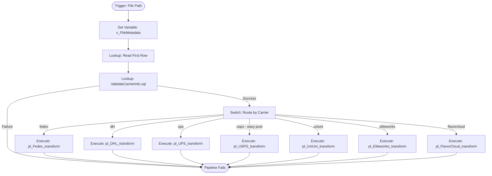
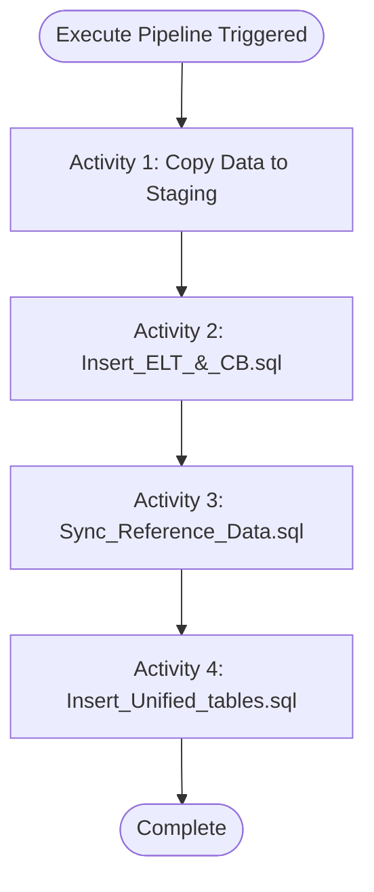
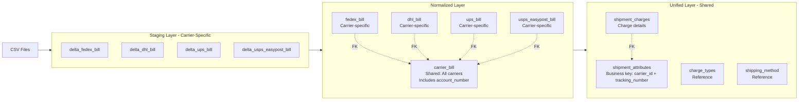

# ADF Bill Ingestion - Architecture Documentation

## 1. Project Overview

This project automates the ingestion of carrier billing CSV files into an Azure SQL Managed Instance. The ingestion process is metadata-driven, utilizing file paths to extract context (Account Numbers) and employing a **"Contract-First"** validation strategy to handle messy CSV structures (duplicate headers).

**Key Design Principles:**
- Metadata-driven orchestration via file path parsing
- Contract-first validation before data processing
- Idempotent pipeline activities for safe retries
- Transactional integrity where needed
- Incremental processing via timestamp tracking
- **Database parameterization:** Database names are parameterized via ADF Linked Services per environment (DEV/UAT/PROD). All SQL scripts reference only `schema.table` format.

---

## 2. Parent Pipeline: `pl_Master_Ingestion`

### Purpose
Entry point for all carrier billing file ingestion. Validates file structure, account numbers, and routes to appropriate carrier-specific child pipeline. **Supports multiple carriers: FedEx, DHL, UPS, USPS EasyPost, and UniUni.**

### Trigger Context
Currently trigger not implemented - in development phase passing file URL as parameter to pipeline runs.

**Future plans:** Will receive file path via event trigger with carrier-specific folder structure:
- FedEx: `falcon/fedex/594939735/bill.csv`
- DHL: `falcon/dhl/0022161907/bill.csv`
- UPS: `falcon/ups/000017X1R2/bill.csv`
- USPS EasyPost: `falcon/usps - easy post/ca_589b9b61d0ed420890f0e826515491dd/bill.csv`
- UniUni: `falcon/uniuni/ACCT001/bill.csv`

### Supported Carriers

| Carrier | Folder Name | Account Position (Lookup) | Account Column | Copy Data Mapping |
|---------|-------------|---------------------------|----------------|-------------------|
| **FedEx** | `fedex` | `Prop_1` | `[Bill to Account Number]` | Ordinal (no headers) |
| **DHL** | `dhl` | `Prop_1` | `account_number` | Ordinal (no headers) |
| **UPS** | `ups` | `Prop_2` | `[Account Number]` | Ordinal (no headers) |
| **USPS EasyPost** | `usps - easy post` | `Prop_32` | `carrier_account_id` | Named (has headers) |
| **UniUni** | `uniuni` | Column name | `[Merchant ID]` | Named (has headers) |
| **Eliteworks** | `eliteworks` | `Prop_2` | `user_account` (Column 3) | Named (has headers) |
| **FlavorCloud** | `flavorcloud` | `Prop_6` | `[Origin Location]` (Column 7) | Named (has headers) |

**Note**: Account Position (Lookup) refers to the ordinal position used in `ValidateCarrierInfo.sql` for account validation. Copy Data Mapping refers to how the staging table is populated.

### Pipeline Variables

| Variable | Type | Purpose |
|----------|------|---------|
| `v_FileMetadata` | Array | Stores parsed file path segments |

### Activity Flow



---

#### Activity 1: Set Variable - `v_FileMetadata`

**Purpose:** Parses file path into structured array for downstream processing.

**Expression:** Splits file path on `/` delimiter.

**Output Array Structure:**
- Index `[0]`: Tenant name (e.g., `falcon`)
- Index `[1]`: Carrier name (e.g., `fedex`, `dhl`, `ups`, `usps - easy post`)
- Index `[2]`: Account number (e.g., `594939735`, `0022161907`, `ca_589b9b61d0ed420890f0e826515491dd`)
- Index `[3]`: Filename (e.g., `bill.csv`)

This metadata drives routing, validation, and carrier-specific processing logic.

---

#### Activity 2: Lookup - Read First Row from CSV

**Purpose:** Reads first data row from CSV file to extract account number for validation.

**Configuration:**
- **Source:** Azure Blob Storage (CSV file)
- **First Row Only:** Yes
- **Column Access:** 
  - FedEx/DHL/UPS: By ordinal position (`Prop_0`, `Prop_1`, `Prop_2`, etc.)
  - USPS EasyPost: By column name (CSV has headers)

**Output:** Returns entire first row as JSON object (e.g., `{"Prop_0": "...", "Prop_1": "594939735", ...}`)

**Note:** This activity does NOT validate - it only reads the data. Validation happens in the next activity.

---

#### Activity 3: Lookup - `ValidateCarrierInfo.sql`

**Purpose:** Multi-carrier account validation with SQL-based logic. Validates account number matches folder structure and retrieves carrier metadata.

**Script:** `parent_pipeline/ValidateCarrierInfo.sql`

**Input Parameters (via dynamic expressions):**
1. `@RawJson`: Entire first row as JSON string from Activity 2
2. `@InputCarrier`: Carrier name from `v_FileMetadata[1]` (lowercase)
3. `@ExpectedAccount`: Account number from `v_FileMetadata[2]`

**Validation Logic:**

The script performs carrier-specific account validation using a CASE statement:

```sql
DECLARE @ActualAccountInFile NVARCHAR(100) = CASE 
    WHEN @InputCarrier = 'fedex' THEN JSON_VALUE(@RawJson, '$.Prop_1')
    WHEN @InputCarrier = 'dhl'   THEN JSON_VALUE(@RawJson, '$.Prop_1')
    WHEN @InputCarrier = 'ups'   THEN JSON_VALUE(@RawJson, '$.Prop_2')
    WHEN @InputCarrier = 'usps - easy post' THEN JSON_VALUE(@RawJson, '$.Prop_32')
    WHEN @InputCarrier = 'uniuni' THEN JSON_VALUE(@RawJson, '$."Merchant ID"')
    WHEN @InputCarrier = 'eliteworks' THEN JSON_VALUE(@RawJson, '$.Prop_2')  -- Column 3: USER
    WHEN @InputCarrier = 'flavorcloud' THEN JSON_VALUE(@RawJson, '$.Prop_6')  -- Column 7: Origin Location
    ELSE 'UNKNOWN_CARRIER'
END;
```

**Note**: Even though some carriers (USPS, UniUni, Eliteworks, FlavorCloud) use named column mapping in the Copy Data activity, the LookupAccountInFile activity uses ordinal positions (Prop_X) for all carriers.

**Validation Rules:**
1. **USPS EasyPost:** Uses `LIKE` matching (account ID format: `ca_xxxxx` where folder contains partial ID)
2. **Other Carriers (FedEx, DHL, UPS, UniUni):** Exact match between file account and folder account
3. **Unknown Carriers:** Raises error if carrier not recognized

**Failure Behavior:**
- Raises `RAISERROR` with descriptive message: `"Validation Failed. Carrier: {name} | Expected: {folder_account} | Found: {file_account}"`
- ADF Lookup activity fails, halting pipeline execution
- Error message visible in ADF monitoring

**Success Behavior:**
Returns carrier metadata and file tracking information for downstream activities:

**Output Variables:**
- `carrier_id` (INT): Carrier identifier from `dbo.carrier` table
- `file_id` (INT): File tracking surrogate key from `billing.file_ingestion_tracker`
- `validated_carrier_name` (NVARCHAR): Lowercase carrier name for Switch activity routing, or 'Skip' if file already processed

**Tables Accessed:**
- `dbo.carrier` (carrier master data)
- `billing.file_ingestion_tracker` (file processing status - creates/checks file records)

**Why SQL Instead of ADF IF Condition:**
- **Maintainability:** Single source of truth for validation logic (easier to update)
- **Flexibility:** JSON parsing handles any CSV structure (ordinal vs named columns)
- **Error Handling:** Descriptive error messages with SQL `FORMATMESSAGE`
- **Metadata Fetch:** Combines validation + carrier lookup in one activity (performance)
- **No ADF Expression Limitations:** Complex logic easier in SQL than nested ADF expressions

---

#### Activity 4: Switch - Route by Carrier

**Purpose:** Routes validated file to appropriate carrier-specific transformation pipeline based on carrier name.

**Switch Expression:** `@activity('ValidateCarrierInfo').output.firstRow.validated_carrier_name`

**Switch Cases:**

| Case Value | Target Pipeline | Carrier |
|------------|----------------|---------|
| `fedex` | `pl_Fedex_transform` | FedEx |
| `dhl` | `pl_DHL_transform` | DHL |
| `ups` | `pl_UPS_transform` | UPS |
| `usps - easy post` | `pl_USPS_transform` | USPS EasyPost |
| `uniuni` | `pl_UniUni_transform` | UniUni |
| `eliteworks` | `pl_Eliteworks_transform` | Eliteworks |
| `flavorcloud` | `pl_FlavorCloud_transform` | FlavorCloud |

**Default Case:** Should never execute (validation would have failed earlier). Can optionally add Fail activity.

**Parameters Passed to Child Pipelines:**
- `p_carrier_id`: From ValidateCarrierInfo output
- `p_file_id`: From ValidateCarrierInfo output
- `v_FileMetadata`: Array containing parsed file path segments

---

### Multi-Carrier Account Number Positions

Each carrier has a different CSV structure. Account numbers appear in different ordinal positions:

**FedEx:**
- **Column:** `[Bill to Account Number]`
- **ADF Position:** `Prop_1` (Column 2, 0-indexed)
- **Schema:** `billing.delta_fedex_bill.[Bill to Account Number]`
- **Type:** Integer account number (e.g., `594939735`)

**DHL:**
- **Column:** `account_number`
- **ADF Position:** `Prop_1` (Column 2, 0-indexed)
- **Schema:** `billing.delta_dhl_bill.account_number`
- **Type:** String account number (e.g., `0022161907`)
- **Note:** DHL CSVs have HDR/DTL record types; account appears in DTL rows

**UPS:**
- **Column:** `[Account Number]`
- **ADF Position:** `Prop_2` (Column 3, 0-indexed)
- **Schema:** `billing.delta_ups_bill.[Account Number]`
- **Type:** Alphanumeric account number (e.g., `000017X1R2`)

**USPS EasyPost:**
- **Column:** `carrier_account_id`
- **ADF Position:** Named column (CSV includes headers)
- **Schema:** `billing.delta_usps_easypost_bill.carrier_account_id`
- **Type:** Carrier account ID format (e.g., `ca_589b9b61d0ed420890f0e826515491dd`)
- **Validation:** Uses `CONTAINS` instead of exact match (folder may have partial ID)

**UniUni:**
- **Column:** `[Merchant ID]`
- **ADF Position:** Named column (CSV includes headers)
- **Schema:** `billing.delta_uniuni_bill.[Merchant ID]`
- **Type:** Alphanumeric merchant identifier (e.g., `ACCT001`)
- **Validation:** Exact match required

**Eliteworks:**
- **Column:** `USER` (Column 3)
- **ADF Position (Lookup):** `Prop_2` (ordinal position for account validation)
- **ADF Position (Copy Data):** Named column `user_account` (CSV includes headers)
- **Schema:** `billing.delta_eliteworks_bill.user_account`
- **Type:** User account name (e.g., `Falcon IT`)
- **Validation:** Exact match required

**FlavorCloud:**
- **Column:** `Origin Location` (Column 7)
- **ADF Position (Lookup):** `Prop_6` (ordinal position for account validation)
- **ADF Position (Copy Data):** Named column `[Origin Location]` (CSV includes headers)
- **Schema:** `billing.delta_flavorcloud_bill.[Origin Location]`
- **Type:** Origin location/account (e.g., `Falcon Fulfillment UT`)
- **Validation:** Exact match required

---

## 3. Child Pipelines: Carrier-Specific Transformation

### Overview
Each carrier has a dedicated child pipeline that processes billing data through a standardized 4-stage transformation: **CSV → Staging → Normalized → Unified**. All carriers follow the same activity pattern but with carrier-specific SQL scripts and staging tables.

**Supported Carriers:**
- `pl_Fedex_transform` (FedEx)
- `pl_DHL_transform` (DHL)
- `pl_UPS_transform` (UPS)
- `pl_USPS_transform` (USPS EasyPost)
- `pl_UniUni_transform` (UniUni)
- `pl_Eliteworks_transform` (Eliteworks)
- `pl_FlavorCloud_transform` (FlavorCloud)

### Parameters Received

| Parameter | Type | Source | Purpose |
|-----------|------|--------|---------|
| `p_carrier_id` | INT | Parent pipeline (ValidateCarrierInfo) | Carrier identifier for data association |
| `p_file_id` | INT | Parent pipeline (ValidateCarrierInfo) | File tracking ID for file-based filtering |
| `v_FileMetadata` | Array | Parent pipeline | File metadata (tenant, carrier, account, filename) |

### Activity Execution Order

**All carrier pipelines follow this standardized 4-activity pattern:**



**Note:** The legacy `LookupCarrierInfo.sql` activity has been replaced. Carrier metadata is now retrieved by the parent pipeline's `ValidateCarrierInfo.sql` script and passed as parameters.

---

### Activity 1: Copy Data - Load Staging Table

**Purpose:** Loads raw CSV data into carrier-specific staging table.

**Source:** Azure Blob Storage (CSV file from file path)

**Target Tables (by carrier):**
- FedEx: `billing.delta_fedex_bill`
- DHL: `billing.delta_dhl_bill`
- UPS: `billing.delta_ups_bill`
- USPS EasyPost: `billing.delta_usps_easypost_bill`
- UniUni: `billing.delta_uniuni_bill`
- Eliteworks: `billing.delta_eliteworks_bill`
- FlavorCloud: `billing.delta_flavorcloud_bill`

**Configuration Options (carrier-specific):**

**FedEx, DHL, UPS (Ordinal Mapping):**
- **First Row as Header:** Unchecked (forces ordinal column names: `Prop_0`, `Prop_1`, etc.)
- **Skip Line Count:** 1 (skips actual header row in file)
- **Column Mapping:** Empty (strict ordinal positioning - Column 1 → Column 1)
- **Reason:** Bypasses ADF's duplicate column name errors; FedEx CSVs have 50+ charge columns with duplicate names

**USPS EasyPost, UniUni, Eliteworks, FlavorCloud (Named Column Mapping):**
- **First Row as Header:** Checked (reads column names from CSV)
- **Skip Line Count:** 0 (header row defines schema)
- **Column Mapping:** Automatic by column name
- **Reason:** Clean CSV structure with unique column names

**Idempotent:** No (truncates staging table before each load, or uses date-based partitioning)

**Purpose Explanation:** The "anonymous positional load" strategy (for FedEx/DHL/UPS) bypasses ADF's duplicate column name errors by treating headers as ordinal positions. This enables ingestion of messy CSVs with duplicate column names.

---

### Activity 2: Script - `Insert_ELT_&_CB.sql`

**Purpose:** Transforms staging data into normalized billing tables within a single transaction. Aggregates line items into invoice summaries and preserves detailed shipment records.

**Scripts (by carrier):**
- `fedex_transform/Insert_ELT_&_CB.sql`
- `dhl_transform/Insert_ELT_&_CB.sql`
- `ups_transform/Insert_ELT_&_CB.sql`
- `usps_easypost_transform/Insert_ELT_&_CB.sql`
- `uniuni_transform/Insert_ELT_&_CB.sql`
- `eliteworks_transform/Insert_ELT_&_CB.sql`
- `flavorcloud_transform/Insert_ELT_&_CB.sql`

**Input Parameters:**
- `@Carrier_id` (or `@carrier_id`): From parent pipeline parameter `p_carrier_id`
- `@File_id`: From parent pipeline parameter `p_file_id`

**Target Tables (2-step process):**

**Step 1: Invoice-Level Aggregation**
- **Table:** `billing.carrier_bill` (shared across all carriers)
- **Columns Inserted:**
  - `carrier_id` - Carrier identifier
  - `bill_number` - Invoice/bill identifier (carrier-specific format)
  - `bill_date` - Invoice date
  - `total_amount` - Sum of all charges on invoice
  - `num_shipments` - Count of shipments on invoice
  - `account_number` - Account number from CSV file
  - `file_id` - **NEW:** File tracking ID for file-based processing
- **Grain:** One row per invoice per carrier
- **Idempotency:** `NOT EXISTS (file_id)` - File-based idempotency check

**Step 2: Line-Item Detail**
- **Tables (carrier-specific):**
  - `billing.fedex_bill` (FedEx line items)
  - `billing.dhl_bill` (DHL line items)
  - `billing.ups_bill` (UPS line items)
  - `billing.usps_easypost_bill` (USPS EasyPost line items)
  - `billing.uniuni_bill` (UniUni line items)
  - `billing.eliteworks_bill` (Eliteworks line items)
  - `billing.flavorcloud_bill` (FlavorCloud line items)
- **Contains:** Shipment-level details with `carrier_bill_id` foreign key
- **Grain:** One row per shipment (varies by carrier)
- **Idempotency:** `NOT EXISTS (carrier_bill_id, tracking_number, ...)` with carrier-specific checks

**File Tracking Benefits:**
- **File-based idempotency:** Same file won't create duplicates (fail-fast detection)
- **Cross-carrier parallel processing:** Different carriers/files process simultaneously
- **Selective file retry:** Rerun specific failed files without reprocessing all data
- **Atomicity per file:** Each file is an independent processing unit

**Transaction Boundaries:** 
- **Transactional:** Yes (wrapped in `BEGIN TRANSACTION` / `COMMIT` / `ROLLBACK`)
- **ACID Properties:** Full atomicity - both steps succeed or both fail together
- **Error Handling:** `TRY...CATCH` block with automatic rollback on error
- **Auto Rollback:** `SET XACT_ABORT ON` ensures immediate rollback on any error

**Carrier-Specific Account Number Sources:**

| Carrier | Account Column in Staging Table | Example Value |
|---------|--------------------------------|---------------|
| FedEx | `[Bill to Account Number]` | `594939735` |
| DHL | `account_number` | `0022161907` |
| UPS | `[Account Number]` | `000017X1R2` |
| USPS EasyPost | `carrier_account_id` | `ca_589b9b61d0ed420890f0e826515491dd` |
| UniUni | `[Merchant ID]` | `ACCT001` |
| Eliteworks | `user_account` | `Falcon IT` |
| FlavorCloud | `[Origin Location]` | `Falcon Fulfillment UT` |

**SQL Pattern (all carriers):**
```sql
INSERT INTO billing.carrier_bill (
    carrier_id, bill_number, bill_date, total_amount, num_shipments, account_number
)
SELECT
    @Carrier_id,
    [invoice_identifier],
    [invoice_date],
    SUM([charge_amounts]),
    COUNT(*),
    MAX([account_column_name])  -- Extract account number
FROM [staging_table]
GROUP BY [invoice_identifier], [invoice_date]
HAVING NOT EXISTS (
    SELECT 1 FROM billing.carrier_bill
    WHERE bill_number = [invoice_identifier]
      AND bill_date = [invoice_date]
      AND carrier_id = @Carrier_id
);
```

**Output Variables:**
- `Status`: 'SUCCESS' or 'ERROR'
- `InvoicesInserted`: Number of carrier_bill records inserted
- `LineItemsInserted`: Number of carrier-specific bill records inserted
- `ErrorNumber`, `ErrorMessage`, `ErrorLine`: Error details (if failure)

**Purpose Explanation:** This two-step transactional script is the core normalization phase. Step 1 aggregates staging data by invoice to create summaries with total amounts, shipment counts, and **account numbers**, generating `carrier_bill_id` surrogate keys. Step 2 inserts line-level details with foreign key references to carrier_bill. The transaction ensures referential integrity - you'll never have orphaned line items without invoice headers. Idempotency via NOT EXISTS checks makes the pipeline safe to retry after transient failures.

---

### Activity 3: Script - `Sync_Reference_Data.sql`

**Purpose:** Auto-discovers and populates reference tables with new charge types and shipping methods from processed billing data. Ensures all downstream foreign key relationships are valid.

**Scripts (by carrier):**
- `fedex_transform/Sync_Reference_Data.sql`
- `dhl_transform/Sync_Reference_Data.sql`
- `ups_transform/Sync_Reference_Data.sql`
- `usps_easypost_transform/Sync_Reference_Data.sql`
- `uniuni_transform/Sync_Reference_Data.sql`
- `eliteworks_transform/Sync_Reference_Data.sql`
- `flavorcloud_transform/Sync_Reference_Data.sql`

**Input Parameters:**
- `@Carrier_id` (or `@carrier_id`): From parent pipeline parameter `p_carrier_id`
- `@File_id`: From parent pipeline parameter `p_file_id` (filters current file's data only)

**Source Tables (carrier-specific):**
- Carrier-specific bill tables (e.g., `billing.fedex_bill`, `billing.dhl_bill`)
- Carrier-specific charge views (e.g., `billing.vw_FedExCharges`)
- `billing.carrier_bill` (joined for file_id filtering)

**Target Tables (shared across all carriers):**
1. `dbo.shipping_method` - Service types (e.g., 'Ground', 'Express', 'DHL Parcel International Standard')
2. `dbo.charge_types` - Charge descriptions (e.g., 'Fuel Surcharge', 'Residential Delivery', 'Delivery Area Surcharge')

**Transaction Boundaries:** 
- **Transactional:** No (two separate INSERT statements)
- **Why No Transaction:** Reference data changes are independent; partial success acceptable

**Idempotent:** Yes
- Block 1: `INSERT ... WHERE NOT EXISTS (method_name, carrier_id)` prevents duplicate shipping methods
- Block 2: `INSERT ... WHERE NOT EXISTS (charge_name, carrier_id)` prevents duplicate charge types
- Safe to run multiple times - only inserts truly new values

**Output Variables:**
- `ShippingMethodsAdded`: Count of new shipping methods discovered
- `ChargeTypesAdded`: Count of new charge types discovered

**Carrier-Specific Examples:**

**FedEx:**
- Discovers service types from `[Service Type]` column (e.g., 'FedEx Ground', 'FedEx Express Saver')
- Unpivots 50+ charge columns via `vw_FedExCharges` view

**DHL:**
- Discovers service types from `shipping_method` column (e.g., 'DHL Parcel International Standard')
- Extracts charges from specific charge columns (transportation, fuel, surcharges)

**UPS:**
- Discovers service types from charge descriptions
- Each row in CSV is one charge (narrow format)

**USPS EasyPost:**
- Discovers service types from `service` column (e.g., 'GroundAdvantage', 'Priority')
- Extracts charges from fee columns (postage_fee, label_fee, insurance_fee)

**UniUni:**
- Discovers service types from `service_type` column (e.g., 'Ground Service', 'Express')
- Charge types pre-populated via one-time setup script (17 charge types: Base Rate, Discount Fee, Signature Fee, etc.)

**Eliteworks:**
- Discovers service types from `service_method` column (e.g., 'Ground Advantage')
- Charge types pre-populated via one-time setup script (1 charge type: Platform Charged)

**FlavorCloud:**
- Discovers service types from `service_level` column (e.g., 'STANDARD', 'EXPRESS')
- Charge types pre-populated via one-time setup script (6 charge types: Shipping Charges, Commissions, Duties, Taxes, Fees, Insurance)

**Purpose Explanation:** This script automatically maintains lookup tables by discovering new values from live data. When carriers introduce new service types or charge descriptions, they're automatically captured and added to reference tables for future lookups. The auto-discovery approach eliminates manual reference data maintenance and ensures downstream transformations always have valid foreign key mappings. Categorization logic applies business rules (e.g., charges containing 'adjustment' → category 16, others → category 11).

---

### Activity 4: Script - `Insert_Unified_tables.sql`

**Purpose:** Transforms carrier-specific normalized billing data into unified analytical tables. Creates standardized business keys (`carrier_id + tracking_number`) and itemized charge breakdowns for cross-carrier analysis.

**Scripts (by carrier):**
- `fedex_transform/Insert_Unified_tables.sql`
- `dhl_transform/Insert_Unified_tables.sql`
- `ups_transform/Insert_Unified_tables.sql`
- `usps_easypost_transform/Insert_Unified_tables.sql`
- `uniuni_transform/Insert_Unified_tables.sql`
- `eliteworks_transform/Insert_Unified_tables.sql`
- `flavorcloud_transform/Insert_Unified_tables.sql`

**Input Parameters:**
- `@Carrier_id` (or `@carrier_id`): From parent pipeline parameter `p_carrier_id`
- `@File_id`: From parent pipeline parameter `p_file_id` (file-based filtering)

**Source Tables (carrier-specific):**
- Carrier-specific bill tables (e.g., `billing.fedex_bill`, `billing.dhl_bill`)
- Carrier-specific charge views (e.g., `billing.vw_FedExCharges`, `billing.vw_DHLCharges`)
- `billing.carrier_bill` (joined for file_id filtering)
- `dbo.charge_types` (for charge type FK lookups)
- `dbo.shipping_method` (for service type FK lookups)

**Target Tables (2-part process, shared across all carriers):**

**Part 1: Shipment Attributes**
- **Table:** `billing.shipment_attributes`
- **Business Key:** `carrier_id + tracking_number` (UNIQUE constraint)
- **Contains:** 
  - Shipment metadata: date, zone, dimensions, weight, service type
  - Recipient address information
  - **NO cost stored** - calculated via view
- **Unit Conversions Applied:**
  - Weight → OZ (LB × 16, KG × 35.274)
  - Dimensions → IN (CM ÷ 2.54, MM ÷ 25.4)
- **Carrier-Specific Logic:**
  - **FedEx:** 4-stage CTE for MPS (Multi-Piece Shipment) classification
  - **DHL:** Differentiates international vs domestic tracking numbers
  - **UPS:** Handles wide charge format (one row per charge per tracking number)
  - **USPS EasyPost:** Simple 1:1 mapping from staging
  - **UniUni:** Wide charge format (17 charge columns unpivoted), uses dimensional weight for billing
  - **Eliteworks:** Single charge per shipment (Platform Charged), weight already in OZ, dimensions already in IN
  - **FlavorCloud:** Wide charge format (6 charge columns unpivoted: Shipping Charges, Commissions, Duties, Taxes, Fees, Insurance)

**Part 2: Shipment Charges**
- **Table:** `billing.shipment_charges`
- **Contains:** Itemized charge breakdown per shipment
- **Foreign Key:** `shipment_attribute_id` references `shipment_attributes(id)` (1-to-Many)
- **Columns:** `charge_type_id`, `amount`, `carrier_bill_id`, `tracking_number`
- **Single Source of Truth:** `billed_shipping_cost` calculated via `vw_shipment_summary` view (SUM of charges)

**FedEx-Specific: Multi-Piece Shipment (MPS) Logic**

FedEx billing includes MPS groups where multiple packages share one master tracking number:

**MPS Classification (4-stage CTE pipeline):**
1. **fx_tallied:** Count occurrences of each tracking ID
2. **fx_classified:** Classify into roles (NORMAL_SINGLE, MPS_HEADER, MPS_PARENT, MPS_CHILD)
3. **fx_hoisted:** Hoist header values via window functions (propagate group data)
4. **fx_final:** Apply unit conversions, filter out MPS_HEADER rows

**MPS Roles:**
- `NORMAL_SINGLE`: Standard single-package shipment
- `MPS_HEADER`: Group summary row (filtered out, not an actual package)
- `MPS_PARENT`: First package in MPS group
- `MPS_CHILD`: Additional packages in group

**UniUni-Specific: Wide Charge Format with Dimensional Weight**

UniUni billing uses a wide-format CSV where each row represents one complete shipment with all charges in separate columns:

**Charge Structure (17 charge types unpivoted):**
- **Base Charges:** Base Rate, Discount Fee, Billed Fee
- **Service Charges:** Signature Fee, Pick Up Fee, Relabel Fee
- **Surcharges:** Over Dimension Fee, Over Max Size Fee, Over Weight Fee, Fuel Surcharge, Peak Season Surcharge, Delivery Area Surcharge, Delivery Area Surcharge Extend, Truck Fee, Credit Card Surcharge
- **Credits:** Miscellaneous Fee, Credit (negative), Approved Claim (negative)

**Weight Logic:**
- Uses `dim_weight` (dimensional weight) as primary billing weight
- Multiple weight fields available: billable_weight, scaled_weight, dim_weight
- Dimensional weight = (length × width × height) ÷ divisor

**Unit Conversions:**
- Weight: LBS × 16 → OZ, OZS → OZ
- Dimensions: CM × 0.393701 → IN, IN → IN (no conversion)

**Charge Type Management:**
- Charge types pre-populated via one-time setup script (not auto-discovered)
- Only shipping methods are auto-discovered from billing data
- Only non-zero charges inserted into `shipment_charges` table

**Transaction Boundaries:** 
- **Transactional:** No (two separate INSERT statements)
- **Why No Transaction:** Each part independently idempotent via constraints; partial success safe
- **Part 2 Dependency:** Requires Part 1 completion for FK lookups (within same script execution)

**Idempotent:** Yes
- Part 1: `INSERT ... WHERE NOT EXISTS (carrier_id, tracking_number)` + UNIQUE constraint prevents duplicates
- Part 2: `INSERT ... WHERE NOT EXISTS (carrier_bill_id, tracking_number, charge_type_id)` prevents duplicates
- View recalculates cost from whatever charges exist (always correct)
- Safe to rerun with same `@File_id` - no double-counting, no corruption

**Output Variables:**
- `Status`: 'SUCCESS' or 'ERROR'
- `AttributesInserted`: Number of shipment_attributes records inserted
- `ChargesInserted`: Number of shipment_charges records inserted
- `ErrorNumber`, `ErrorMessage`, `ErrorLine`: Error details (if failure)

**Purpose Explanation:** This is the unified data model population phase, transforming carrier-specific normalized data into a standardized analytical structure. All carriers write to the same two tables (`shipment_attributes` and `shipment_charges`), enabling cross-carrier analysis and reporting. The business key (`carrier_id + tracking_number`) uniquely identifies shipments across all carriers. The 1-to-Many relationship between attributes and charges enables flexible cost tracking - corrections/adjustments automatically accumulate via the view calculation (single source of truth). No stored cost in attributes table eliminates sync bugs. Idempotency is architected via constraints and NOT EXISTS checks rather than transactions, making the pipeline resilient to partial failures and safe for unlimited retries.

---

## 4. Data Model Overview

### Architecture Layers

**Multi-Carrier Support:** All carriers follow the same 3-layer architecture (Staging → Normalized → Unified). Carrier-specific tables exist in Staging and Normalized layers, while Unified layer tables are shared across all carriers.



### Business Key Concept

**`shipment_attributes.id`** serves as the universal business key representing unique `carrier_id + tracking_number` combinations across all carriers.

**Enforced by:**
- PRIMARY KEY on `id` (IDENTITY)
- UNIQUE INDEX on `(carrier_id, tracking_number)`

**Relationship:**
- One `shipment_attributes` row → Many `shipment_charges` rows (1-to-Many)
- Foreign Key: `shipment_charges.shipment_attribute_id` references `shipment_attributes(id)`

**Cost Calculation:**
- `billed_shipping_cost` is NOT stored in `shipment_attributes`
- Calculated on-the-fly via `vw_shipment_summary` view: `SUM(shipment_charges.amount)`
- Single source of truth eliminates sync issues
- Corrections accumulate automatically (additive charges)

### Table Relationships

| Layer | Table | Purpose | Key Columns | Grain | Multi-Carrier |
|-------|-------|---------|-------------|-------|---------------|
| **Staging** | `delta_[carrier]_bill` | Raw CSV replica | Carrier-specific columns | One row per CSV record | ❌ Carrier-specific |
| **Normalized** | `carrier_bill` | Invoice summaries | `carrier_bill_id` (PK), `bill_number`, `bill_date`, `carrier_id`, `account_number` | One row per invoice per carrier | ✅ **Shared** |
| **Normalized** | `[carrier]_bill` | Line items | `id` (PK), `carrier_bill_id` (FK), `tracking_number` | Varies by carrier format | ❌ Carrier-specific |
| **Unified** | `shipment_attributes` | Shipment master | `id` (PK), `carrier_id`, `tracking_number`, metadata (NO cost) | One row per unique carrier_id + tracking_number | ✅ **Shared** |
| **Unified** | `shipment_charges` | Charge breakdown | `id` (PK), `shipment_attribute_id` (FK), `charge_type_id` (FK), `amount` | One row per charge per shipment | ✅ **Shared** |
| **Reference** | `charge_types` | Charge lookup | `charge_type_id` (PK), `charge_name`, `carrier_id` | One row per charge type per carrier | ✅ **Shared** |
| **Reference** | `shipping_method` | Service lookup | `shipping_method_id` (PK), `method_name`, `carrier_id` | One row per service type per carrier | ✅ **Shared** |
| **View** | `vw_shipment_summary` | Calculated cost | All `shipment_attributes` + `billed_shipping_cost` (SUM) | One row per unique carrier_id + tracking_number | ✅ **Shared** |

### carrier_bill Table Details

**Purpose:** Shared invoice summary table for all carriers. Aggregates line items by invoice, capturing total amounts, shipment counts, and account numbers.

**Key Columns:**
- `carrier_bill_id` (PK, IDENTITY) - Surrogate key
- `carrier_id` - Foreign key to `dbo.carrier` table
- `bill_number` - Invoice/bill identifier (carrier-specific format)
- `bill_date` - Invoice date
- `total_amount` - Sum of all charges on invoice
- `num_shipments` - Count of shipments on invoice
- `account_number` - Account number from CSV file (extracted during ingestion)
- `file_id` - **NEW:** Foreign key to `billing.file_ingestion_tracker` (file-based processing)

**Unique Constraint:**
- `UQ_carrier_bill_number_date_carrier` on `(bill_number, bill_date, carrier_id)`
- Prevents duplicate invoices per carrier

**Foreign Key:**
- `FK_carrier_bill_file_ingestion` on `file_id` references `file_ingestion_tracker(file_id)`

**Account Number Sources:**
- FedEx: `[Bill to Account Number]` (e.g., `594939735`)
- DHL: `account_number` (e.g., `0022161907`)
- UPS: `[Account Number]` (e.g., `000017X1R2`)
- USPS EasyPost: `carrier_account_id` (e.g., `ca_589b9b61d0ed420890f0e826515491dd`)

---

## 5. Integration Points

### Error Handling Strategy

**Parent Pipeline:**
- **Validation Failures:** `ValidateCarrierInfo.sql` raises `RAISERROR`, halting pipeline execution
- **Error Messages:** Descriptive messages include carrier name, expected account, and found account
  - Format: `"Validation Failed. Carrier: {name} | Expected: {folder_account} | Found: {file_account}"`
- **Monitoring:** Error details visible in ADF Lookup activity monitoring
- **Unknown Carriers:** Script raises error if carrier not recognized in CASE statement

**Child Pipelines:**
- **Activity-Level Errors:** Each SQL script returns structured error information
  - `Status`: 'SUCCESS' or 'ERROR'
  - `ErrorNumber`, `ErrorMessage`, `ErrorLine`: Detailed error context
- **Transactional Rollback:** `Insert_ELT_&_CB.sql` automatically rolls back on failure
- **ADF Retry:** Pipelines can safely retry failed activities due to idempotency design

### Retry Behavior

**Safe to Retry (Idempotent Activities):**
1. ✅ `ValidateCarrierInfo.sql` - Read-only query with validation logic
2. ✅ `Copy Data` - Truncates staging table before load (idempotent by design)
3. ✅ `Insert_ELT_&_CB.sql` - NOT EXISTS checks + transaction rollback creates clean state
4. ✅ `Sync_Reference_Data.sql` - NOT EXISTS checks prevent duplicates
5. ✅ `Insert_Unified_tables.sql` - Constraints + NOT EXISTS checks prevent duplicates

**Retry Scenario Example:**

| Event | carrier_bill | [carrier]_bill | State |
|-------|--------------|----------------|-------|
| **First Attempt** | Inserts invoice (id=1001) | Fails on row 101/150 | ❌ Rollback |
| **After Rollback** | No data (id=1001 deleted) | No data | ✅ Clean |
| **Retry** | Inserts invoice (id=1002) | All 150 rows succeed | ✅ Success |

NOT EXISTS check passes on retry because it looks for `carrier_bill_id=1002`, not `1001`.

### Monitoring Outputs

**Row Count Tracking:**
Each transformation activity returns row counts for monitoring:
- Insert_ELT_&_CB: `InvoicesInserted`, `LineItemsInserted`
- Sync_Reference_Data: `ShippingMethodsAdded`, `ChargeTypesAdded`
- Insert_Unified_tables: `AttributesInserted`, `ChargesInserted`

**Status Indicators:**
- `Status = 'SUCCESS'` - Activity completed successfully
- `Status = 'ERROR'` - Activity failed with error details

**ADF Integration:**
- Output variables captured in ADF for alerting and dashboards
- Error details logged to ADF run history
- Row counts enable data quality monitoring

### File-Based Processing

**Mechanism:** `@File_id` parameter (from `file_ingestion_tracker` table via `ValidateCarrierInfo.sql`)

**Activities Using File-Based Filter:**
- `Insert_ELT_&_CB.sql`: Stores `file_id` in `carrier_bill` table, checks `WHERE cb.file_id = @File_id` for idempotency
- `Sync_Reference_Data.sql`: Joins `carrier_bill` and filters `WHERE cb.file_id = @File_id`
- `Insert_Unified_tables.sql`: Joins `carrier_bill` and filters `WHERE cb.file_id = @File_id` in both parts

**File Tracking Flow:**
1. **ValidateCarrierInfo.sql** creates/checks file record in `file_ingestion_tracker`
   - Returns `file_id` if file not yet completed
   - Returns 'Skip' if file already completed (fail-fast duplicate detection)
2. Child pipeline processes data filtered by `file_id`
3. **CompleteFileProcessing.sql** marks file as completed (`completed_at` timestamp set)

**Benefits:**
- **Idempotency:** Same file won't create duplicates (file_id check in carrier_bill)
- **Parallelism:** Different carriers/files process simultaneously without conflicts
- **Selective Retry:** Rerun specific failed files without reprocessing all data
- **Atomicity:** Each file is an independent processing unit
- **Fail-Fast:** Duplicate file detection before any processing begins

**Source:** Parent pipeline's `ValidateCarrierInfo.sql` creates file record and returns `file_id` to child pipeline

**Completion Mechanism:** `CompleteFileProcessing.sql` updates `file_ingestion_tracker.completed_at` after successful pipeline completion

---

## 6. Future Enhancements

### ✅ Completed: Multi-Carrier Support
- ✅ **Implemented:** Parameterized child pipeline selection via Switch activity based on carrier name
- ✅ **Implemented:** Four carriers supported: FedEx, DHL, UPS, USPS EasyPost
- ✅ **Implemented:** Carrier-specific transformation logic isolated in separate folders (`[carrier]_transform/`)
- ✅ **Implemented:** Multi-carrier account validation via `ValidateCarrierInfo.sql`
- ✅ **Implemented:** Account number captured in `carrier_bill` table for all carriers

### Additional Carriers
- Add support for additional carriers as needed (e.g., OnTrac, LSO, etc.)
- Follow established pattern: Create `[carrier]_transform/` folder with 3 scripts
- Update `ValidateCarrierInfo.sql` with new carrier's account position
- Add new case to parent pipeline Switch activity

### Monitoring & Alerting
- Automated data quality checks post-ingestion
- Alert on orphaned records or amount discrepancies
- Track transaction duration and performance metrics

### Incremental Loading
- Automated update of `last_run_time` in tracker table
- Only process new/changed invoices
- Reduce processing time for large datasets

### Performance Optimization
- Add composite indexes for faster NOT EXISTS checks
- Consider columnstore indexes for analytical queries
- Partition large tables by date range

### Data Layer Architecture: Mapping vs Reconciliation

**Business Model:** Map physical shipment data (WMS) with financial data (carrier bills), then reconcile discrepancies.

**Architectural Separation:**

```
┌─────────────────────────────────────────────────────┐
│  MAPPING LAYER (Set-Based)                          │
│  ─────────────────────────────                      │
│  • shipment_package_wip                             │
│  • Workload: INSERT + Bulk SELECT joins             │
│  • Access Pattern: Set-based mapping queries        │
│  • Index Strategy: ✅ COLUMNSTORE (perfect fit)     │
└─────────────────────────────────────────────────────┘
                        ↓
              (Mapped data flows to)
                        ↓
┌─────────────────────────────────────────────────────┐
│  RECONCILIATION LAYER (CRUD)                        │
│  ────────────────────────────                       │
│  • carrier_cost_ledger                              │
│  • Workload: Create, Update, Read, Delete           │
│  • Access Pattern: Row-level operations             │
│  • Index Strategy: ✅ ROWSTORE (proper choice)      │
└─────────────────────────────────────────────────────┘
```

**Optimization Rationale:**

**Mapping Layer (`shipment_package_wip`):**
- **Write-once, read-many pattern** - Data inserted during ETL, then queried for bulk reconciliation
- **Set-based joins** - All mapping queries join carrier bills with WMS shipment data in bulk
- **No CRUD operations** - No updates or deletes after initial insert
- **Columnstore benefits:**
  - 10x compression (storage cost reduction)
  - Faster set-based joins (columnar storage optimized for scanning)
  - Improved ETL performance for bulk reconciliation operations
  - Zero trade-offs (no single-row lookups exist)

**Reconciliation Layer (`carrier_cost_ledger`):**
- **CRUD workload** - User-driven variance resolution with row-level updates
- **Transactional operations** - Dispute tracking, adjustments, approvals
- **Rowstore benefits:**
  - Fast single-row lookups and updates
  - Optimized for OLTP patterns
  - Traditional B-tree indexes ideal for point queries

**Key Insight:** Workload isolation enables optimal indexing strategy for each layer. CRUD operations are contained to `carrier_cost_ledger`, making columnstore a zero-compromise choice for `shipment_package_wip`.

**Implementation Priority:** High - Significant ETL performance improvement with reduced storage costs for mapping workload.

---

## 7. Related Files

### Parent Pipeline Scripts

| File | Purpose | Execution Order |
|------|---------|-----------------|
| `parent_pipeline/ValidateCarrierInfo.sql` | Multi-carrier account validation + carrier metadata retrieval | 1st (Lookup Activity) |
| `parent_pipeline/LookupCarrierInfo.sql` | **Legacy:** Replaced by ValidateCarrierInfo.sql | Deprecated |
| `parent_pipeline/Load_to_gold.sql` | Post-processing script (if used) | After child pipeline completion |

### Carrier-Specific SQL Scripts

**All carriers follow this standardized 3-script pattern:**

| Carrier | Script | Purpose | Execution Order |
|---------|--------|---------|-----------------|
| **FedEx** | `fedex_transform/Insert_ELT_&_CB.sql` | Staging → Normalized (transactional) | 1st |
| | `fedex_transform/Sync_Reference_Data.sql` | Auto-discover shipping methods and charge types | 2nd |
| | `fedex_transform/Insert_Unified_tables.sql` | Normalized → Unified (with MPS logic) | 3rd |
| | `fedex_transform/Fedex_charges.sql` | View: Unpivots 50 charge columns | Referenced by scripts |
| **DHL** | `dhl_transform/Insert_ELT_&_CB.sql` | Staging → Normalized (transactional) | 1st |
| | `dhl_transform/Sync_Reference_Data.sql` | Auto-discover shipping methods and charge types | 2nd |
| | `dhl_transform/Insert_Unified_tables.sql` | Normalized → Unified | 3rd |
| **UPS** | `ups_transform/Insert_ELT_&_CB.sql` | Staging → Normalized (transactional) | 1st |
| | `ups_transform/Sync_Reference_Data.sql` | Auto-discover shipping methods and charge types | 2nd |
| | `ups_transform/Insert_Unified_tables.sql` | Normalized → Unified | 3rd |
| **USPS EasyPost** | `usps_easypost_transform/Insert_ELT_&_CB.sql` | Staging → Normalized (transactional) | 1st |
| | `usps_easypost_transform/Sync_Reference_Data.sql` | Auto-discover shipping methods and charge types | 2nd |
| | `usps_easypost_transform/Insert_Unified_tables.sql` | Normalized → Unified | 3rd |
| **UniUni** | `uniuni_transform/Insert_ELT_&_CB.sql` | Staging → Normalized (transactional) | 1st |
| | `uniuni_transform/Sync_Reference_Data.sql` | Auto-discover shipping methods (charge types pre-populated) | 2nd |
| | `uniuni_transform/Insert_Unified_tables.sql` | Normalized → Unified (unpivots 17 charge columns) | 3rd |
| **Eliteworks** | `eliteworks_transform/Insert_ELT_&_CB.sql` | Staging → Normalized (transactional) | 1st |
| | `eliteworks_transform/Sync_Reference_Data.sql` | Auto-discover shipping methods (charge types pre-populated) | 2nd |
| | `eliteworks_transform/Insert_Unified_tables.sql` | Normalized → Unified (single charge: Platform Charged) | 3rd |
| **FlavorCloud** | `flavorcloud_transform/Insert_ELT_&_CB.sql` | Staging → Normalized (transactional) | 1st |
| | `flavorcloud_transform/Sync_Reference_Data.sql` | Auto-discover shipping methods (charge types pre-populated) | 2nd |
| | `flavorcloud_transform/Insert_Unified_tables.sql` | Normalized → Unified (unpivots 6 charge columns) | 3rd |

### Documentation

| File | Purpose |
|------|---------|
| `schema.sql` | Complete database schema DDL (all carriers + unified tables) |
| `DESIGN_CONSTRAINTS.md` | 10 design rules for carrier integration |
| `fedex_transform/FEDEX_SPECIFIC_LOGIC.md` | FedEx MPS logic and business rules |
| `dhl_transform/additional_reference.md` | DHL-specific reference documentation |
| `ups_transform/UPS_reference_doc.md` | UPS-specific reference documentation |
| `usps_easypost_transform/IMPLEMENTATION_SUMMARY.md` | USPS EasyPost implementation notes |
| `uniuni_transform/UniUni_reference_doc.md` | UniUni-specific reference documentation (17 charge types, unit conversions) |
| `eliteworks_transform/Eliteworks_Business_Reference.md` | Eliteworks business context (single charge, invoice grouping, no unit conversion) |
| `flavorcloud_transform/FlavorCloud_Business_Reference.md` | FlavorCloud business context (6 charge types, international shipping, DDP) |
| `techdebt.md` | Known technical debt and planned improvements |
| `architecture.md` | This document - pipeline architecture and orchestration |

### Pipeline Configuration (ADF)

**Parent Pipeline:**
- `pl_Master_Ingestion` - Entry point with ValidateCarrierInfo and Switch routing

**Child Pipelines:**
- `pl_Fedex_transform` - FedEx transformation pipeline
- `pl_DHL_transform` - DHL transformation pipeline
- `pl_UPS_transform` - UPS transformation pipeline
- `pl_USPS_transform` - USPS EasyPost transformation pipeline
- `pl_UniUni_transform` - UniUni transformation pipeline
- `pl_Eliteworks_transform` - Eliteworks transformation pipeline
- `pl_FlavorCloud_transform` - FlavorCloud transformation pipeline

### Example CSV Files

| Carrier | Example File | Notes |
|---------|-------------|-------|
| FedEx | (Not in repo) | Wide format with 50+ charge columns |
| DHL | `dhl_transform/dhl_example_bill.csv` | HDR/DTL record types |
| UPS | `ups_transform/ups_example_bill.csv` | Narrow format (one charge per row) |
| USPS EasyPost | `usps_easypost_transform/usps_easypost_example_bill.csv` | Clean CSV with headers |
| UniUni | `uniuni_transform/uniuni_example_bill.csv` | Wide format with 17 charge columns, uses dimensional weight |
| Eliteworks | `eliteworks_transform/eliteworks_example_bill.csv` | Single charge per shipment (Platform Charged), weight in OZ, dimensions in IN |
| FlavorCloud | `flavorcloud_transform/flavorcloud_example_bill.csv` | Wide format with 6 charge columns (international shipping) |
