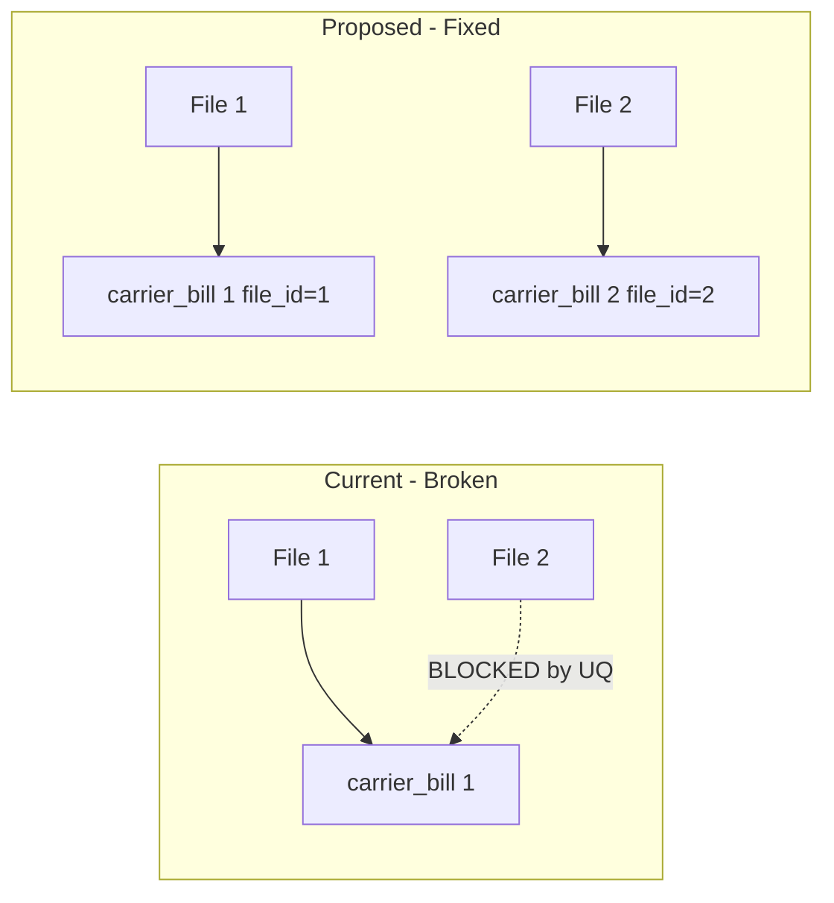

# Correctional Invoice Mitigation Plan

**Scope:** FedEx pilot only. Schema change is global; script changes apply to FedEx first. Rollout to other carriers after validation.

---

## Problem Summary

The current model enforces **one carrier_bill per invoice** via `UQ_carrier_bill_number_date_carrier` on `(bill_number, bill_date, carrier_id)`. When a correctional/adjustment file arrives with the **same invoice number** as a previously processed file, the INSERT fails because the invoice already exists. This breaks the assumption that `file_id` and `carrier_bill` have a strict 1:M relationship (one file → many carrier_bills, but each invoice only once).

**Root cause:** Carriers send correctional charges in separate files that reference the same invoice. The business reality is **M:M** between files and invoices: one invoice can appear in multiple files, and one file can have multiple invoices.

---

## Proposed Solution: Include file_id in Business Key (Least Migration)

Allow **multiple carrier_bill rows per invoice** (one per file). Each file gets its own carrier_bill(s), preserving full audit trail and file-based processing.

### Data Model Change



**New grain:** One `carrier_bill` per `(invoice, carrier, file)` instead of per `(invoice, carrier)`.

---

## Implementation Steps

### 1. Schema Migration (migration.sql)

**Schema changes required to be written in [migration.sql](migration.sql) — overwrite the file.**

- **Drop** existing unique index:
  ```sql
  DROP INDEX UQ_carrier_bill_number_date_carrier ON billing.carrier_bill;
  ```

- **Create** new filtered unique index that includes `file_id`:
  ```sql
  CREATE UNIQUE NONCLUSTERED INDEX UQ_carrier_bill_number_date_carrier_file
  ON billing.carrier_bill (bill_number, bill_date, carrier_id, file_id)
  WHERE carrier_id IS NOT NULL AND bill_date IS NOT NULL AND file_id IS NOT NULL;
  ```

### 2. Insert_ELT Script Updates (FedEx Pilot)

**Critical:** Step 2 joins `delta_fedex_bill` to `carrier_bill` to resolve `carrier_bill_id`. With multiple carrier_bills per invoice, the join must be disambiguated by `file_id`.

**Add to the carrier_bill join in Step 2:**
```sql
AND cb.file_id = @File_id
```

**File to update (pilot):**
- fedex_transform/Insert_ELT_&_CB.sql

**Future rollout:** Apply same pattern to UPS, DHL, EasyPost, Eliteworks, Flavorcloud, UniUni after pilot validation.

**FedEx change:**
```sql
-- Before
INNER JOIN billing.carrier_bill cb
    ON cb.bill_number = NULLIF(TRIM(d.[Invoice Number]), '')
    AND cb.bill_date = NULLIF(TRIM(d.[Invoice Date]), '')
    AND cb.carrier_id = @Carrier_id

-- After
INNER JOIN billing.carrier_bill cb
    ON cb.bill_number = NULLIF(TRIM(d.[Invoice Number]), '')
    AND cb.bill_date = NULLIF(TRIM(d.[Invoice Date]), '')
    AND cb.carrier_id = @Carrier_id
    AND cb.file_id = @File_id  -- Disambiguate when same invoice in multiple files
```

### 3. No Changes Required (FedEx)

- **fedex_transform/Sync_Reference_Data.sql** – Already filters by `cb.file_id = @File_id`
- **fedex_transform/Insert_Unified_tables.sql** – Already filters by `cb.file_id = @File_id`
- **Load_to_gold.sql** – Already filters by `cb.file_id = @File_id`
- **parent_pipeline** – No changes (per DESIGN_CONSTRAINTS)
- **shipment_charges** – UQ is `(carrier_bill_id, tracking_number, charge_type_id)`; multiple carrier_bills per invoice means different carrier_bill_ids, so no conflict

---

## Downstream Impact

| Component | Impact |
|----------|--------|
| `shipment_attributes` | None – business key remains `(carrier_id, tracking_number)` |
| `shipment_charges` | None – charges link to carrier_bill_id; correctional charges get new carrier_bill_id |
| `vw_shipment_summary` | None – sums charges by shipment_attribute_id; multiple carrier_bills contribute correctly |
| `carrier_cost_ledger` | None – uses carrier_bill_id |
| Validation tests | May need to account for multiple carrier_bills per invoice in file-total vs charges-total checks |

---

## Rollback

If needed: drop new indexes, recreate `UQ_carrier_bill_number_date_carrier` on `(bill_number, bill_date, carrier_id)`. Data already inserted for correctional files would need manual handling (duplicate invoices would violate the old constraint).

---

## Verification (FedEx Pilot)

After migration, for a FedEx correctional file with invoice X:

1. `ValidateCarrierInfo.sql` creates file record → returns `file_id`
2. `Insert_ELT_&_CB.sql` inserts new `carrier_bill` for invoice X with `file_id` (no unique violation)
3. Line items insert into `fedex_bill` (or carrier-specific table) with new `carrier_bill_id`
4. Sync and Unified scripts process only rows where `cb.file_id = @File_id`
5. `Load_to_gold.sql` loads charges for the correctional file
